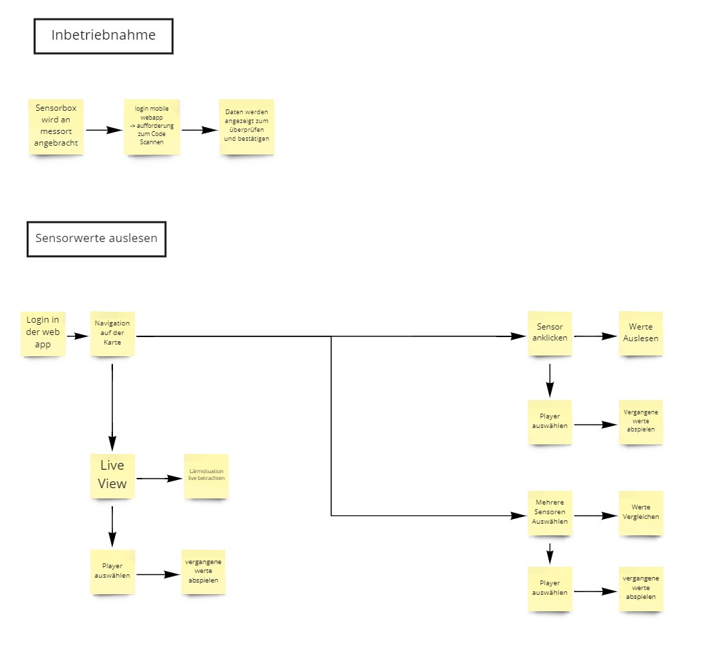
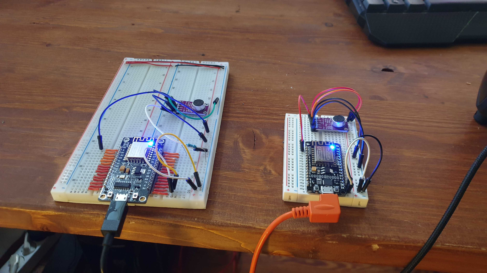
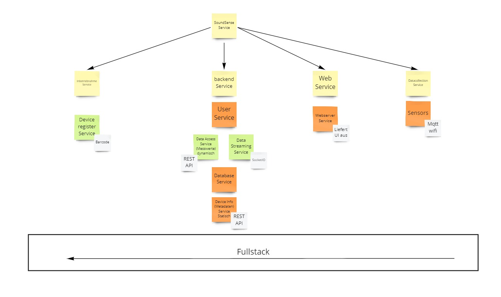

## soundsense-backend
<br>
<br>

 # Inhaltsangabe
 <br>

 + [Inbetriebnahme](#Inbetriebnahme)
 + [Funktionsflow](#Funktionsflow)
 + [Technologien](#Technologien)
 + [Todos/Future Work](#future-work)
 + [Links](#Links)

 


<br>


# Inbetriebnahme
<br>

voraussetzung zur Inbetriebnahme des Backends ist node.js
<br>
Nachdem dann das Repo heruntergladen wurde wird es mit 
```
npm start
```
gestartet und läuft dann über die lokale rechner IP. Allerdings wird hierzu noch eine "dotenv" datei benötigt die hier nicht in das Repo mitgepusht wurde in der die Umgebungsvariablen difiniert sind. Hier sind die Datenbank keys und die verbindungsdaten für TTN gespeichert. Die TTN daten sind in dieser Version noch ungenutzt können aber bei LoRa implementierung genutzt werden. LEdiglich der Datenbank key muss hier ersetzt werden.
Eine gehostete version kann allerdings schon unter `soundsensefe.ds.ava.hfg.design` aufgerufen und getestet werden. Hier kann über einen REST client wie ARC oder Postman auf das Backend zugegriffen werden.

<br>
<br>
<br>

## dotenv Datei Aufbau
```
DB_CONNECTION= <your DB key>
TTN_KEY= <Your TTN key>
TTN_URL=mqtt://eu.thethings.network:1883
TTN_CLI= <TTN device id>
TTN_USR= <TTN user id>

```

<br>
<br>
<br>

## Sensor Eisntellungen
Um den Sensor in betrieb zu nehmen muss man in der soundmodule_V2.ino nur ein paar Variablen anpassen.
In Zeile 33 und 34 müssen die Wifi Zugangsdaten eingetragen werden und in Zeile 159 das mqtt topic damit die Sensordaten nicht an die öffentliche Anwendung geschickt werden.

<br>
<br>
<br>
<br>

# Funktionsflow
<br>

Hier sieht man den Funktionsflow des Systems und welche Funktionen vom Konzept vorgesehen sind



<br>
<br>
<br>
<br>
<br>
<br>
<br>

# Technologien
<br>

## Sensor Prototypen

Hier sieht man die Prototypen der Sensoren. Diese Basieren auf einem ESP8266 Mikrocontroller und einem Max 9814 Mikrofonmodul. Diese Schicken alle 30 Sekunden einen Messwert über Wifi und mqtt an das backend.
Im konzept sind allerdings Heltec WiFi LoRa 32 Module die per TTN ihre daten an das Backend übermitteln vorgesehen. Zur besseren prototypisierung eines Sensors wurdie allerdings hier an dieser Stelle auf WiFi zurückgergiffen. Gut zu sehen ist hier auch noch dass die Sensoren noch per USB mit Energie versorgt werden. Im finalen Produkt wird die Energieversorgung dann über ein Solarmodul in Kombination mit einem Lipo akku der über eine Ladeelektronik geladen wird gewährleistet. Dies erlaubt es dass die Sensoren autark und ohne externe Stromversorgung laufen können. Um dann noch zusätzlich Energie einsparen zu können kann der Sensor in einen Deep sleep modus versetzt werden zwischen jedem Messzyklus. Dies bedeutet dass er alle 30 Sekunden "aufwacht" einen Messwert übermittelt und danach wieder in den sleep modus fällt. Dies sollte auf längere sicht deutlich energie einsparen und somit zu einer Längeren Laufzeit des systems beitragen.



<br>
<br>
<br>
<br>

## Techtree

Hier sieht man den Techtree des Systems. Hier sind die Micorservices aufgelistet die von technischer Seite aus das Soundsense Gesamtsystem darstellen und in ihrer Summe den Fullstack ergeben.



<br>
<br>
<br>


## Benutzte Technologien 

* WiFi + MQTT 
* MongoDB (No SQL Datenbank) 
* REST API
* VUE (im Frontend)

<br>
<br>
<br>

## Speicherbedarf Datenbank und Skalierung
<br>
Dadurch dass von jedem Sensor alle 30 Sekunden ein Messwert ausgeht ist der Speicherbedarf der Datenbank sehr hoch. Bereits ein sensor hat nach einer laufzeit von etwas mehr als drei Tagen ein Megabyte an Daten generiert. Wenn das system auf mehrere Sensoren hochskaliert wird Skalieren die Datenmengen natürlich Proportional mit hoch. Dementsprechend müsste für eine tatsächliche Anwendung darauf geachtet werden dass die Datenbank mitskalieren kann, heißt dass das Speicherandgebot ausreichend sein sollte um die Datenmengen die Durch das System anfallen gespeichert werden können. Aufgrund der Hohen datenmengen wurde auch der Kompromiss getroffen einen MEsszyklus von 30 Sekunden durchzuführen. Ein kürzerer Messzyklus würde dafür sorgen dass zwar die Genauigkeit der messung steigt aber die datenmengen sich bei einer verkürzung auf z.B. 15 sekunden verdoppeln und bei 10 sekunden sogar verdreifachen. Ein längerer Messzyklus führt im gleichen sinne auch dazu dass zwar die Datenbankauslastung sinkt aber ebenso auch die Messgenauigkeit.

<br>
<br>
<br>
<br>

<br>


## REST API nutzung

<br>

eine get anfrage auf `/getSoundData` gibt die sound daten collection aus in der alle Messwert datensätze gelistet sind.


<br>
<br>

Mit einer post anfrage auf `/addSensor` mit dem Inhalt deviceId, long, lat und adress (nachzusehen in der route addSensor.js) können Sensoren mit den dazugehörigen Metadaten hinzugefügt werden.
Alternativ exisitert hier auch eine Frontend Seite die den Registrierprozess simuliert. In diesem Prozess soll mithilfe eines QR codes auf dem die MAC Adresse gespeichert ist und über die longitude und latitude des mobile devices auf dem die Inbetriebnahme durchgeführt wird der Sensor zum system hinzugefügt werden. Zusätzlich kann hier auch noch eine Adresse mitgeschickt werden die man manuell eingibt. Um dies zu simulieren wurde eine schlichte html Seite erstellt die diese Aufgabe übernimmt und über eine manuelle Eingabe die Daten in die Datenbank schreibt. Allerdings müsste beim manuellen hinzufügen eines Sensors noch ein SoundData Objekt angelegt werden mit der dazugehörigen id sodass das Frontend keinen Fehler wirft. Bei einem Realen Sensor passiert dies allerdings nicht da er sobald er eingeschaltet wird automatisch Messwerte in die datenbank schreibt.

<br>
<br>

Aufrufen kann man diese dann unter `https://soundsensefe.ds.ava.hfg.design/#/reg`

<br>
<br>


Eine GET Anfrage auf `/getDevice` gibt die device Daten Collection aus. In dieser sind alle registrierten Sensoren gelistet.

<br>
<br>
<br>

## post model 

<br>

```javascript
router.post('/', async (req, res) => {
  const newDevice = Device({
    deviceId: req.body.deviceId,
    long: req.body.long,
    lat: req.body.lat,
    adress: req.body.adress,
  });
  newDevice.save();
```


<br>


<br>
<br>
<br>
<br>
<br>
<br>
<br>

<a name="future-work"></a>
# Todos/Future Work

<br>

Um das system aus einem Prototypischen Stand in einen Finalen Stand zu heben gibt es noch einige Punkte die erfüllt werden müssen.

+  Im frontend müssten noch für den Vorgesehenen Betrieb noch die Replay Funktion, Graphen und eine Heatmap implementiert werden (siehe Frontend Repo)
+ Ein Nutzeraccount System muss noch implementiert werden um zwischen den nutzern die die Sensoren verteilen und in Betrieb nehmen und den nutzern die sich die Daten ansehen unterschieden werden kann.
+ Es muss darauf geachtet werden dass die Datenbank mit den Datenmengen mitskaliert. Ein ensprechender Datenbankanbieter oder einne dementsprechend große Datenbank sollte benutzt werden.
+ Die Sensoren müssen noch mit Solarmodulen und Akkus in kombination mit einem Deep Sleep des Sensors kombiniert werden um einen Langzeitbetrieb gewährleisten zu können.
+ Sicherheitsfeatures müssen hierbei auch bedacht werden um sich vor Hackerangriffen und Botnetzen wie z.B. mirai zu schützen. Beim auftreten von sicherheitslücken sollten diese Umgehend geschlossen werden. Besser ist es jedoch im system vor dem Finalen Zustand alle bekannten IOT sciherheitslücken geschlossen zu schließen.

<br>
<br>
<br>
<br>
<br>
<br>
<br>


<br>
<br>
<br>
<br>

# Links
Frontend Repository [Klick here](https://github.com/IoTSteve/soundsense-frontend)

<br>
<br>

### HfG Online Exhibition Page
<!--See [Configuration Reference](https://cli.vuejs.org/config/).-->
link will follow prior to the exhibition weekend
